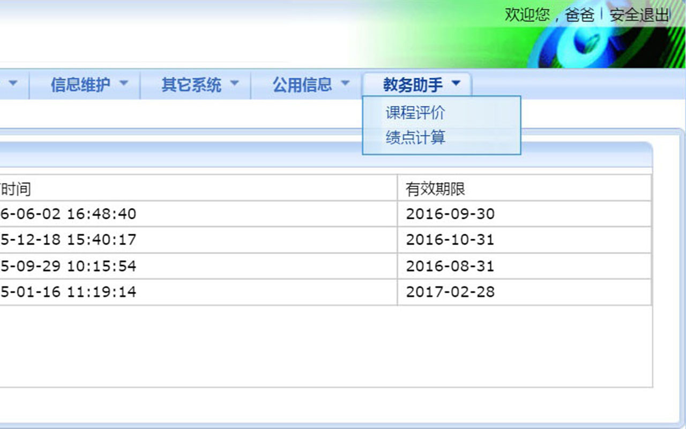

# FZJW Helper
方正教务助手，让繁琐的 `正方教务系统` 更易于使用。

## 添加书签！

1. 将下面的 `代码` 作为 `网址` 添加到书签。

	```JavaScript
	javascript: (function() {
		var el = document.createElement('script');
		el.setAttribute('type', 'text/javascript');
		el.setAttribute('src','https://rawgit.com/Rocket1184/fzjwHelper/master/CreateMenu.js');
		document.body.appendChild(el);
	})();
	```

2. 打开 `方正教务系统` ，并点击刚刚添加的书签。

3. 稍等~~第一次加载的时间可能长达一分钟~~片刻，在顶部的导航栏最右边，会出现名为 `教务助手` 的一项。
> 

4. Just Enjoy It!

### 如果不想添加书签...

1. 在 `教学评价` 页面，按下 `F12` 键。

2. 在弹出的界面中，寻找 `Console` 或 `控制台` 面板，并点击进入。

3. 将刚才的 `代码` 复制到控制台的 `输入` 区，之后按下 `Enter` 键。


## 功能介绍

### Part I : 一键评教

- Firefox 用户：

	使用成功时，在页面最下方的 `保存` 与 `提交` 按钮 **之后**，会出现另外 4 个按钮：
	
	好评，中评，差评，看脸。
	
	只需按动按钮，自动填写十个评价项目，之后转到下一个老师的评价页面。
	
	>注意：为防止误操作，助手不会自动提交评价；请在评价完成后自行检查评价内容，并提交评价。

- Chrome 用户：

	没时间解释了，快上车！
 
	按下 `确定` 按钮以开启 Rampage 模式。
 
	>Rampage 模式：全自动。默认中评，在评价一页之后自动跳转到下一页进行评价；循环往复直至全部评价结束。
 
	>注意： Rampage 模式仍然不会自动提交评价。
 
	~~我才不会说这样处理是因为 Chrome 的 JS 引擎怎~~
	
- Microsoft Edge 用户：

	因为 Edge 的浏览器 UA 包含 Chrome，所以会被视为 Chrome 。
	
	你也可以自行修改 [脚本](kcpj.js)，使其像在 Firefox 中一样工作。

- 其他浏览器，请自行测试。

### Part II : 平均绩点计算

平均绩点会显示在表格的大标题后面，你肯定一眼就会发现自己~~惨不忍睹~~的绩点 = =

每一科的绩点会单独展示，原列表中的 `成绩` 项会变为 `成绩/绩点` 。

在老师给分为等级而不是分数时，对照表如下：

|优秀|良好|中等|合格|“其他情况”|
|:-:|:-:|:-:|:-:|:-:|
|5.0|4.0|3.0|2.0|0.0|

>此功能仍在施工，如有不便请谅解，最好提个 issue ~~

## TODO:

#### 功能添加
- [x] 评教
- [x] 绩点计算
- [ ] 培养计划
- [ ] To be added....

#### 浏览器插件
- [ ] Chrome
- [ ] Firefox
