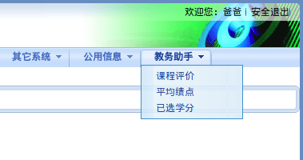

# FZJW Helper

方正教务助手，让繁琐的 `正方教务系统` 更易于使用。

## 使用方式

1. 将下面的 `代码` 作为 `网址` 添加到书签。

```JavaScript
javascript:(function(){var el=document.createElement('script');el.setAttribute('type','text/javascript');el.setAttribute('src','https://rawgit.com/Rocket1184/fzjwHelper/master/CreateMenu.js');document.body.appendChild(el);})();
```

2. 打开 `正方教务系统` ，并点击刚刚添加的书签。

3. 稍等片刻~~第一次加载的时间可能长达一分钟~~，在顶部的导航栏最右边，会出现名为 `教务助手` 的一项。



4. Just Enjoy It!

### 如果不想添加书签

1. 在 `教学评价` 页面，按下 `F12` 键。

2. 在弹出的界面中，寻找 `Console` 或 `控制台` 面板，并点击进入。

3. 将刚才的 `代码` 复制到控制台的 `输入` 区，之后按下 `Enter` 键。

## 功能介绍

### 一键评教

先进入 “理论教学质量评价” 页面，然后选择导航栏中的 教务助手->课程评价

- 如果你想“稍微”认真地评价一下：

脚本加载完成后，在页面最下方的 `保存` 与 `提交` 按钮 **之后**，会出现另外 6 个按钮：

|名称|评价|
|:-:|:-|
|好评|9A1B|
|较好|A、B 随机|
|中评|B、C 随机|
|较差|C、D 随机|
|差评|1C9D|
|看脸|A ~ D 随机|

只需按动按钮，即可自动填写十个评价项目，并自动转到下一个老师的评价页面。

> 为防止误操作，助手不会自动提交评价；请在评价完成后自行检查评价内容，并提交评价。

- 如果你想马上结束：

脚本加载完成后，在控制台输入 `Rampage()` 并回车，进入 Rampage 模式。

全自动，默认中评，在评价一页之后自动跳转到下一页进行评价；循环往复直至全部评价结束。

> Rampage 模式仍然不会自动提交评价。

### 平均绩点计算

先进入 “成绩查询” 页面（信息查询->成绩查询），选择学年和学期，点击 “查询”，等待成绩表格加载完毕后，再选择导航栏中的 教务助手->平均绩点

平均绩点会显示在表格的大标题后面，你肯定一眼就会发现自己~~惨不忍睹~~的绩点 = =

每一科的绩点会单独展示，原列表中的 `成绩` 项会变为 `成绩/绩点` 。

在老师给分为等级而不是分数时，对照表如下：

|优秀|良好|中等|合格|“其他情况”|
|:-:|:-:|:-:|:-:|:-:|
|5.0|4.0|3.0|2.0|0.0|

### 已选学分

先进入 “学生选课情况查询” 页面（信息查询->学生选课情况查询），选择学年和学期，等待成绩表格加载完毕后，再选择导航栏中的 教务助手->已选学分

就会以对话框的形式弹出 “本学期已选学分为 xxxx”
